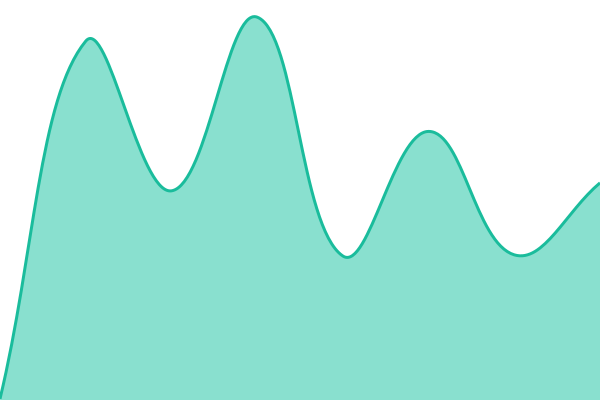

# [ExportComments Status](https://status.exportcomments.com)

This repository contains the status page for [ExportComments](https://exportcomments.com), powered by [Upptime](https://github.com/upptime/upptime).

Live status: **https://status.exportcomments.com**

<!--start: status pages-->
<!-- This summary is generated by Upptime (https://github.com/upptime/upptime) -->
<!-- Do not edit this manually, your changes will be overwritten -->
<!-- prettier-ignore -->
| URL | Status | History | Response Time | Uptime |
| --- | ------ | ------- | ------------- | ------ |
|  [ExportComments App](https://exportcomments.com) | 🟩 Up | [export-comments-app.yml](https://github.com/exportcomments/status/commits/HEAD/history/export-comments-app.yml) | 

 395ms
     
 | 

<a href="https://status.exportcomments.com/history/export-comments-app">100.00%</a>
    

|  [ExportComments API](https://exportcomments.com/api/public/health) | 🟩 Up | [export-comments-api.yml](https://github.com/exportcomments/status/commits/HEAD/history/export-comments-api.yml) | 

 126ms
     
 | 

<a href="https://status.exportcomments.com/history/export-comments-api">100.00%</a>
    

|  [Documentation](https://docs.exportcomments.com) | 🟩 Up | [documentation.yml](https://github.com/exportcomments/status/commits/HEAD/history/documentation.yml) | 

 355ms
     
 | 

<a href="https://status.exportcomments.com/history/documentation">100.00%</a>
    

<!--end: status pages-->
